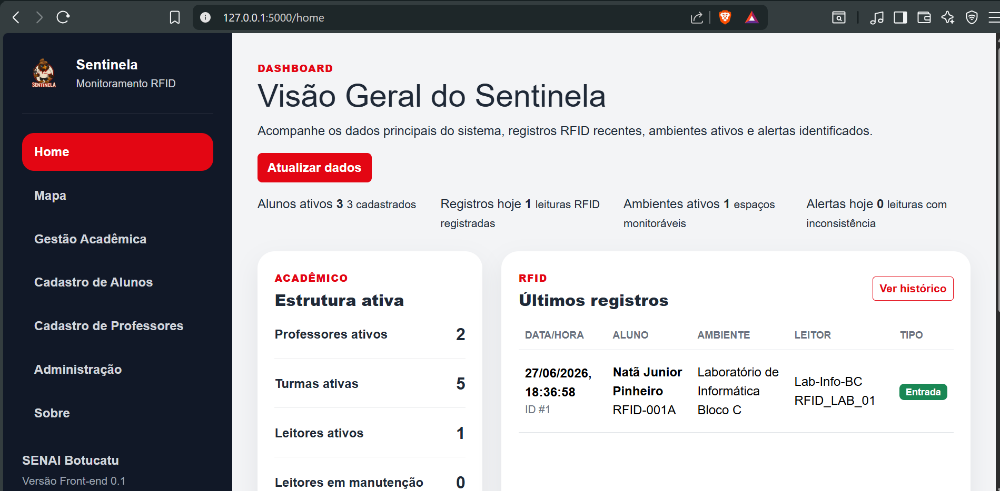
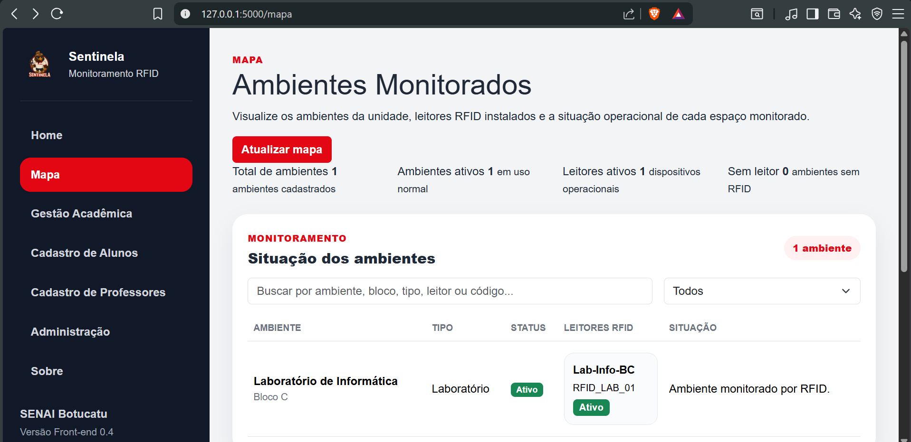
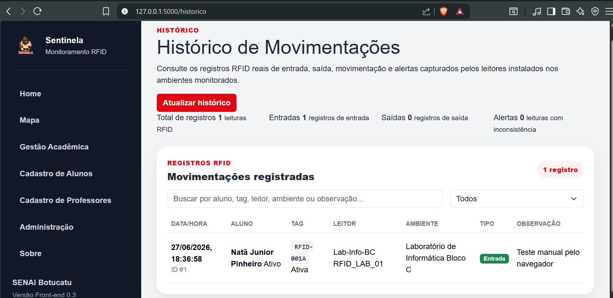
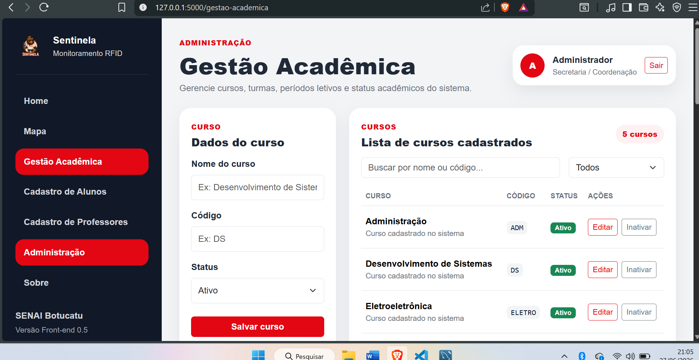

# Sentinela v0.1.2

**Sentinela** é um sistema web de chamada automática e monitoramento escolar por RFID, desenvolvido como projeto de TCC para centralizar cadastros acadêmicos, ambientes monitorados, leitores RFID, registros de movimentação e visualização operacional em painéis administrativos.

A versão **0.1.2** é uma versão de apresentação do projeto: ela mantém a base funcional da v0.1.1 e melhora a documentação para que qualquer pessoa que acesse o repositório consiga entender rapidamente a proposta, o estado atual, a arquitetura e os próximos passos.

> Status: protótipo funcional integrado ao banco de dados. Ainda não é uma versão pronta para produção.

---

## Demonstração visual

### Home / Dashboard



### Mapa de ambientes monitorados



### Histórico RFID



### Gestão Acadêmica



---

## O que o sistema já faz

A versão 0.1.2 contém a primeira base funcional do Sentinela:

- Cadastro de alunos com vínculo de tag RFID.
- Cadastro de professores.
- Gestão acadêmica de cursos, turmas e vínculo professor-turma.
- Gestão de ambientes físicos monitorados.
- Gestão de leitores RFID vinculados aos ambientes.
- Registro de leituras RFID por API.
- Histórico real de movimentações integrado ao MySQL.
- Dashboard com resumo do banco de dados.
- Mapa com ambientes e leitores reais.
- Administração com resumo operacional do sistema.
- Página Sobre com explicação do projeto.

O fluxo principal implementado é:

```txt
Aluno cadastrado
↓
Tag RFID vinculada
↓
Leitor RFID instalado em um ambiente
↓
Leitura RFID registrada pela API
↓
Histórico exibe a movimentação
↓
Dashboard e Mapa refletem os dados reais
```

---

## Tecnologias utilizadas

- Python
- Flask
- MySQL
- HTML
- CSS
- JavaScript
- Bootstrap
- RFID
- Arduino UNO R4 WiFi, previsto para integração física futura

---

## Estrutura do projeto

```txt
Sentinela_v0.1.2/
├── app.py
├── config.py
├── database.py
├── requirements.txt
├── .env.example
├── .gitignore
├── README.md
├── CHANGELOG.md
├── RELEASE_NOTES_v0.1.2.md
├── database/
│   ├── schema.sql
│   └── seed.sql
├── docs/
│   ├── api.md
│   ├── arquitetura.md
│   ├── fluxo-rfid.md
│   ├── instalacao.md
│   ├── modelo-dados.md
│   ├── roadmap.md
│   └── visao-geral.md
├── routes/
├── templates/
├── static/
└── assets/
    └── screenshots/
```

---

## Como rodar o projeto localmente

### 1. Clone o repositório

```bash
git clone https://github.com/SEU_USUARIO/SEU_REPOSITORIO.git
cd SEU_REPOSITORIO
```

### 2. Crie e ative um ambiente virtual

Windows:

```bash
python -m venv .venv
.venv\Scripts\activate
```

Linux/macOS:

```bash
python3 -m venv .venv
source .venv/bin/activate
```

### 3. Instale as dependências

```bash
pip install -r requirements.txt
```

### 4. Configure o banco de dados

Crie o banco usando os scripts SQL:

```sql
SOURCE database/schema.sql;
SOURCE database/seed.sql;
```

### 5. Configure as variáveis de ambiente

Copie o arquivo de exemplo:

Windows:

```bash
copy .env.example .env
```

Linux/macOS:

```bash
cp .env.example .env
```

Depois edite o arquivo `.env` com as configurações locais do MySQL.

### 6. Inicie o Flask

```bash
python app.py
```

Acesse:

```txt
http://127.0.0.1:5000
```

---

## Rotas principais

Páginas:

```txt
/                       Login visual
/home                   Dashboard
/mapa                   Mapa de ambientes monitorados
/historico              Histórico RFID
/cadastro-alunos        Cadastro de alunos
/cadastro-professores   Cadastro de professores
/gestao-academica       Cursos, turmas e vínculos professor-turma
/gestao-ambientes       Ambientes monitorados
/gestao-leitores        Leitores RFID
/administracao          Painel administrativo
/sobre                  Sobre o sistema
```

APIs:

```txt
/api/status
/api/dashboard/resumo
/api/alunos
/api/professores
/api/cursos
/api/turmas
/api/professor-turma
/api/ambientes
/api/leitores-rfid
/api/registros-rfid
```

Mais detalhes estão em [`docs/api.md`](docs/api.md).

---

## Limitações atuais

Esta versão ainda não possui:

- Autenticação real no backend.
- Senhas com hash.
- Perfis e permissões por usuário.
- Chamada automática definitiva por aula.
- Integração completa com hardware físico.
- Relatórios exportáveis.
- Testes automatizados.
- Paginação nas listagens.
- Camada de serviços ou ORM.

Essas limitações são intencionais para a fase atual. O objetivo da v0.1.2 é apresentar a base funcional já construída.

---

## Roadmap resumido

```txt
v0.1.2 — apresentação pública e documentação do protótipo funcional
v0.2.0 — autenticação real, sessões e perfis de acesso
v0.3.0 — chamada automática com aulas e presença
v0.4.0 — integração com hardware RFID físico
v0.5.0 — relatórios, filtros avançados e exportações
v1.0.0 — versão estável e apresentável como sistema completo
```

Mais detalhes estão em [`docs/roadmap.md`](docs/roadmap.md).

---

## Observação sobre segurança

O arquivo `.env` real não deve ser enviado para o GitHub. Use apenas o `.env.example` como modelo.

A autenticação atual ainda é visual/local e deve ser substituída por autenticação real em versão futura antes de qualquer uso com dados sensíveis.

---

## Autor

Projeto desenvolvido por **Lucas Norio Dias Sugano** como parte do projeto Sentinela.
